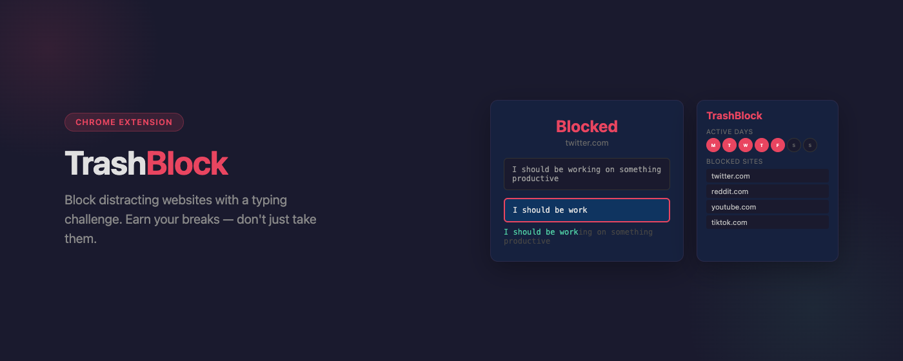
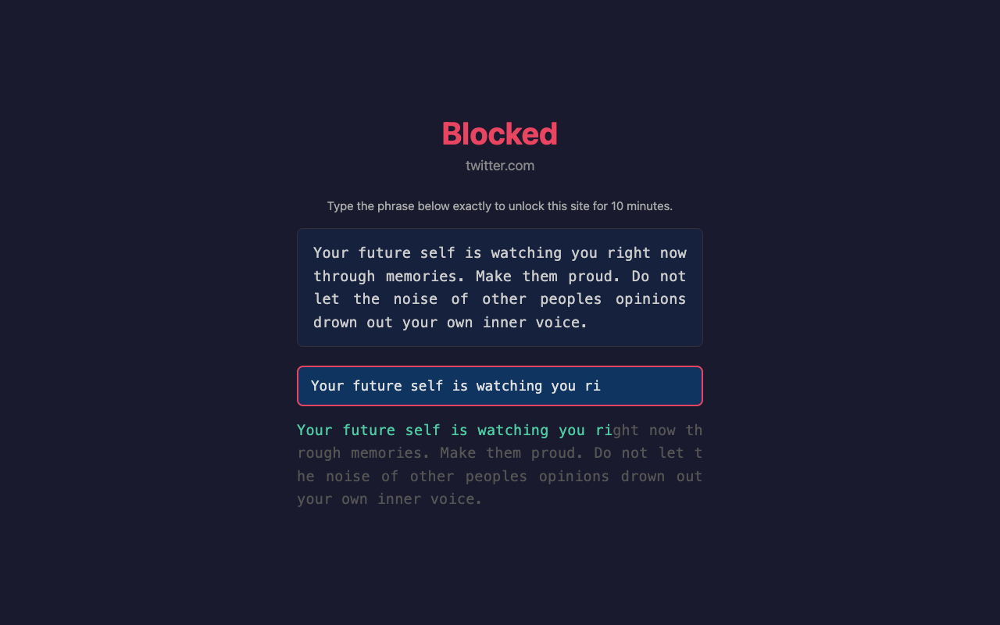
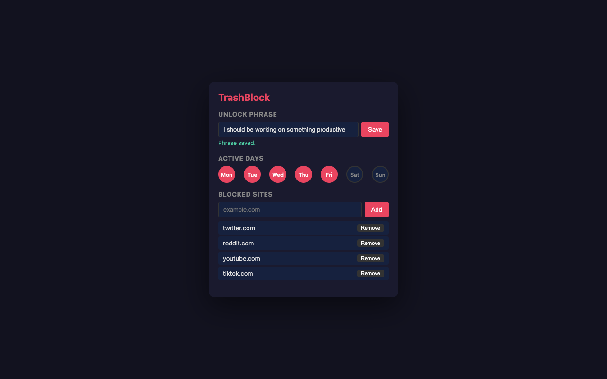

# TrashBlock

A Chrome extension that blocks distracting websites with a typing challenge. No tracking, no accounts, no data collection — just friction between you and your distractions.

The friction of typing a phrase like "I should be working on something productive" is enough to break the autopilot habit of opening distracting sites — without being so strict that you can never access them.

## How It Works

1. Add any website to your block list (e.g., `twitter.com`, `reddit.com`, `youtube.com`)
2. When you try to visit a blocked site, you'll see a full-page challenge
3. Type your unlock phrase exactly to get 10 minutes of access
4. After 10 minutes, the site is blocked again automatically

## Screenshots

  
  

## Features

- **Custom unlock phrase** — Set any phrase you want. Changing it requires typing the current phrase first, so you can't cheat in a moment of weakness.
- **Day scheduling** — Choose which days of the week blocking is active. Block social media on weekdays but allow it on weekends.
- **10-minute unlock window** — Long enough to check something specific, short enough to prevent rabbit holes. Blocks again automatically.
- **Subdomain blocking** — Blocking `twitter.com` also blocks `mobile.twitter.com` and any other subdomains.
- **Full-page block screen** — No tiny popups or notifications. A clean, focused challenge page that makes you think about whether you really need to visit the site.
- **Protected settings** — Removing a site from the block list or changing your phrase requires completing the typing challenge. No quick toggles to disable in a moment of weakness.

## Install

### From Chrome Web Store

Coming soon.

### From Source

1. Clone this repo
2. Open `chrome://extensions` in Chrome
3. Enable "Developer mode" (top right)
4. Click "Load unpacked" and select the repo folder

## Privacy

TrashBlock is 100% offline and private:

- Zero data collection or transmission
- No analytics, no tracking, no third-party services
- All settings stored locally on your device
- Open source

See the [privacy policy](https://arxtage.github.io/trashblock/privacy-policy.html).

## License

MIT
